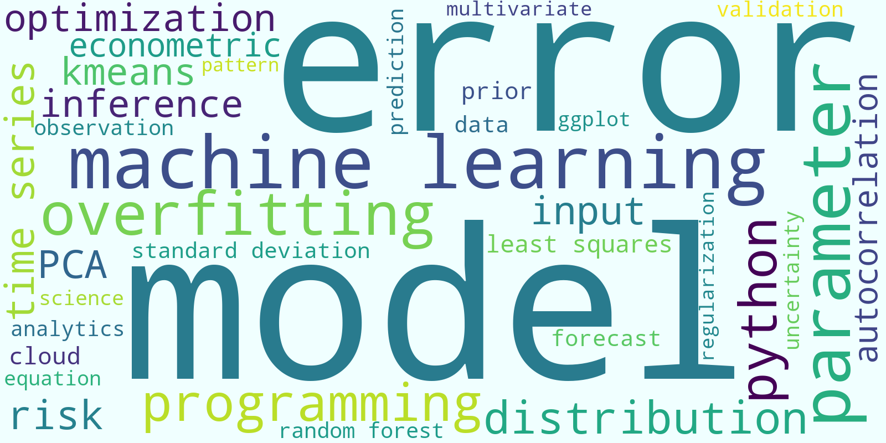

Dario Del Giudice <a href="#/" onclick="document.getElementById('player').play()"> <i class="fa fa-volume-up" aria-hidden="true"></i></a> is a scientist and engineer leveraging Bayesian statistics, differential equation models, and machine learning for improved descriptive and predictive analytics.

<audio id="player" src="/images/DG_surname.mp3"></audio>

Dr. Del Giudice earned a PhD degree from the [Institute of Technology in Zurich](https://ethz.ch/en/the-eth-zurich/portrait/rankings.html), an MSc from the [École Polytechnique](https://www.timeshighereducation.com/world-university-rankings/ecole-polytechnique-federale-de-lausanne), and a BSc from the [University of Bologna](https://www.timeshighereducation.com/world-university-rankings/university-bologna#survey-answer). After having worked at [Stanford](https://dge.carnegiescience.edu/), now at [NCSU](https://www.ccee.ncsu.edu/research/ewc/) he is focusing on probabilistically predicting how anthropogenic pollution and hydrometeorological variability combine to cause severe eutrophication in critical systems such as the Great Lakes. 

